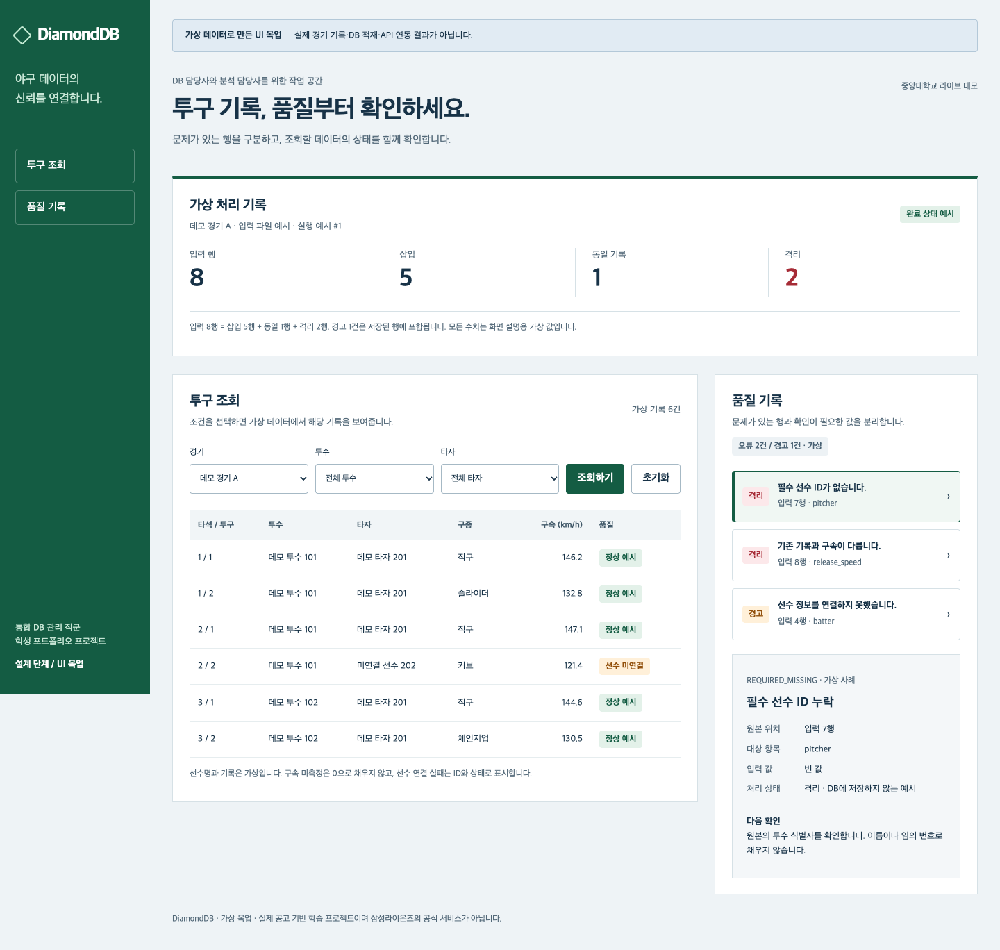

# 5장: 목업을 실행하고 브라우저에서 오류 찾기

> **시간**: 목업 범위 확정 16:54:36, 초기화 오류 증거 17:00:28, PC 요청 17:08:21 KST. 실제 작업 시간과 디버깅 소요 시간은 미측정.
> **비용**: 로컬 정적 목업, 프로젝트 AWS 사용 없음. AI 비용 미확인.
> **핵심 발견**: 화면이 보이는 것과 사용자 조작이 작동하는 것은 별개의 검증입니다.

## 상황

사용자는 ‘설계와 UI 목업까지만’으로 범위를 정한 뒤 다음을 요청했습니다.

## 실제 프롬프트

```text
목업 UI가 모바일최적화로 작성되었어. 일반 PC 에도 대응되게 해줘.
```

## 진행한 일

HTML·CSS·JavaScript 만으로 가상 자료를 표시했습니다. 투구 조회, 경기·선수 필터, 품질 오류 상세를 만들고 실제 경기·DB·API가 아니라는 표시를 유지했습니다. 필터는 메모리의 가상 배열을 대상으로 동작합니다.

### 디버깅: 초기화 버튼이 작동하지 않음

- **증상**: 필터 결과 2건과 빈 결과는 보였지만 초기화 후 6건으로 돌아오지 않았습니다.
- **원인**: 버튼의`id="reset"`이 폼의`reset` 메서드를 가렸습니다. 브라우저에서`typeof form.reset`은`object`, 대상은`BUTTON`이었고 로그에`form.reset is not a function`이 나왔습니다.
- **수정**: 버튼 ID와 선택자를`reset-filters`로 바꿨습니다. `form.reset()`과 화면 렌더링은 유지했습니다.
- **재검증**: 초기 6건 → 투수 필터 2건 → 빈 경기 → 초기화 6건, 오류 상세 변경을 확인했습니다.
- **소요 시간**: 미측정. 발견·수정 로그 시각을 실제 작업 시간으로 단정하지 않습니다.

### PC 대응

1440px이상에서는 조회·품질을 2:1로 나란히 배치했습니다. 1280px에서는 고정 탐색 영역과 한 열, 390px에서는 상단 탐색과 한 열을 사용합니다. 1920px 도 확인했고 모바일 표는 내부에서 가로 스크롤됩니다. Tab·Enter로 오류를 선택하고 포커스 표시를 확인했습니다.

## 결과



[모바일 이미지](../../projects/diamonddb/docs/diagrams/mockup-mobile.png)와 [확인 기록](../../projects/diamonddb/docs/ui-mockup.md)을 비교하세요. 모든 경기·선수·구속·건수는 가상입니다.

## 배운 점

AI 에게 레이아웃과 상호작용을 함께 요구하세요. 오류 메시지를 읽고 실제 DOM 값을 확인하면 추측성 수정이 줄어듭니다. CSS의 반응형 규칙뿐 아니라 브라우저의 실제 창 크기를 확인합니다.

## 직접 해보기

```sh
node --check projects/diamonddb/mockup/app.js
python3 -m http.server 18767 --bind 127.0.0.1 --directory projects/diamonddb/mockup
```

`http://127.0.0.1:18767/`을 열고 투수 102·빈 경기·초기화를 눌러 위 결과를 확인하세요. 키보드로 오류 항목을 선택하고 창을 390·1280·1440·1920px로 바꿉니다. 서버는 Ctrl+C로 종료합니다. `node --check` 통과만으로 화면 기능 검증이 끝나는 것은 아닙니다.

## 누적 비용 기록

| 단계 | 실제 작업 | 이번 프로젝트 AWS 사용료 | 누적 추적 AWS 사용료 | 별도 비용 |
|---|---|---:|---:|---|
| 이 장까지 |조사·문서·로컬 목업 또는 Pages, AWS 리소스 미배포 |$0.00 |$0.00 |AI·Exa·GitHub 청구 미확인 |

월 운영 견적은 발생 비용으로 더하지 않습니다. 다른 AWS 계정 리소스의 비용은 조사하지 않았습니다.
