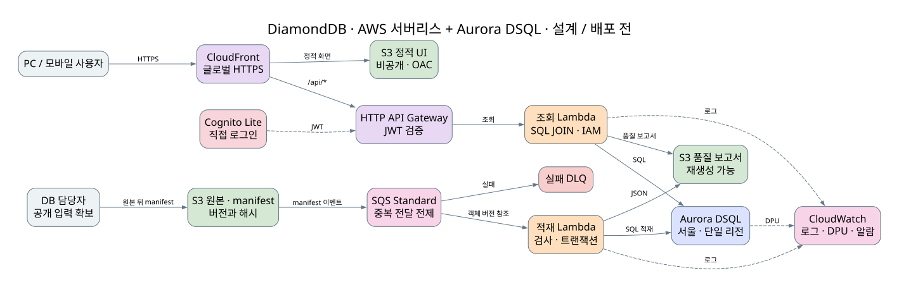

# DiamondDB

**야구 데이터를 검증하고, 연결하고, 조회하는 데이터 품질·통합 플랫폼**

**[GitHub Pages에서 공개 UI 목업 보기](https://roboco.io/cau-vibecoding-demo/)**

중앙대학교 라이브 코딩 및 통합 DB 관리 직군 포트폴리오를 위한 프로젝트입니다. Diamond는 야구장을, DB는 핵심 직무를 뜻합니다. 이름은 시연용으로 선정했으며 상표·서비스명 독점 여부를 확인한 것은 아닙니다.

현재 범위: **AWS 서버리스·Aurora DSQL 설계, 비용 산정과 가상 데이터 기반 UI 목업**. DB·API·데이터 처리 구현과 실제 데이터 다운로드·AWS 배포는 수행하지 않았습니다. 운영 설계와 사용량은 계획이며 실제 운영 성과를 뜻하지 않습니다.

## 문서

- [Overview: 문제·사용자·범위·완료 기준](docs/overview.md)
- [아키텍처와 데이터 흐름](docs/architecture.md)
- [데이터 계약과 오류 처리](docs/data-contract.md)
- [검증 및 라이브 시연 계획](docs/validation.md)
- [심층 인터뷰 기록](docs/interview.md)
- [UI 목업과 화면 검증](docs/ui-mockup.md)
- [ADR-001: 공개 자료와 재현 가능한 입력](docs/adr/001-data-sources.md)
- [ADR-002: 최초 로컬 설계 (대체됨)](docs/adr/002-local-stack.md)
- [ADR-003: 품질 검사·격리·재적재 정책](docs/adr/003-quality-and-ingestion.md)
- [ADR-004: 화면·API·AI의 책임 경계](docs/adr/004-ui-api-ai-boundaries.md)
- [ADR-005: AWS 서버리스 운영 구성](docs/adr/005-aws-serverless.md)
- [ADR-006: SQL 필수 조건과 Aurora DSQL](docs/adr/006-aurora-dsql.md)
- [월 10만 요청 운영 비용](docs/cost-estimate.md)
- [운영·복구 계획](docs/operations.md)

## 아키텍처 미리보기



[편집 가능한 Draw.io](docs/diagrams/architecture.drawio) · [Graphviz 원본](docs/diagrams/architecture.dot)

## 기술 선택과 실행

운영 목표는 서울 리전의 CloudFront·S3 정적 화면, API Gateway HTTP API·Python Lambda 조회, Aurora DSQL 관계형 DB, S3·SQS·Lambda 적재입니다. 인증은 Cognito Lite, 관측은 CloudWatch를 제안합니다. SQL 사용은 사용자가 추가한 필수 조건입니다. 선택 이유는 ADR-005·006에 기록했습니다. 초기 로컬 SQLite 설계는 대체했습니다.

UI 목업 실행 (저장소 루트에서):

```sh
python3 -m http.server 18767 --bind 127.0.0.1 --directory projects/diamonddb/mockup
# http://127.0.0.1:18767/
```

목업은 가상 데이터의 필터·오류 상세·빈 상태를 확인하는 정적 화면입니다. 위 명령은 목업용이며 실제 DB·API 실행 명령이 아닙니다.

공개 목업은 `.github/workflows/pages.yml`이 이 프로젝트의 `mockup/`만 업로드하여 GitHub Pages에 배포합니다. 저장소 Pages source는 GitHub Actions이며 조직 사이트의 `roboco.io` 도메인을 상속합니다. 이 프로젝트에 별도 CNAME을 추가하지 않습니다. 공개 GitHub Pages는 현재 시연용이고 CloudFront·Aurora DSQL은 향후 운영 설계입니다.

현재 문서·저장소 검사:

```sh
# 저장소 루트에서 실행
node scripts/check.mjs
git diff --check
python3 projects/diamonddb/scripts/estimate_cost.py
python3 projects/diamonddb/scripts/estimate_cost.py --free-tier
```

비용 계산기는 AWS에 연결하지 않고 저장한 공식 단가와 가정으로 계산합니다. 월 10만 API 요청 기준 기본 가정은 무료 사용량 적용 전 **$6.33**, 무료 사용량을 모두 쓸 수 있으면 **$0.86**입니다. 상세 가정·범위는 비용 문서를 참조합니다. 기능 검증은 [검증 계획](docs/validation.md)을 기준으로 구현 후 수행합니다.

## 근거

[채용공고 분석](../../research/samsung-lions-db-role-2026-10-06.md) · [데이터 조사와 후보 비교](../../research/baseball-project-proposals-2026-10-06.md) · [가상 목표 프로필](../../portfolio/profile.md)

외부 자료 확인일: 2026-10-06. 데이터 사용 조건은 코드 라이선스와 구분하고, 원본·로컬 DB·환경 파일의 커밋 여부는 구현 시 명시합니다. 이 문서 작성 과정에서는 데이터나 비밀 정보를 저장하지 않았습니다.
