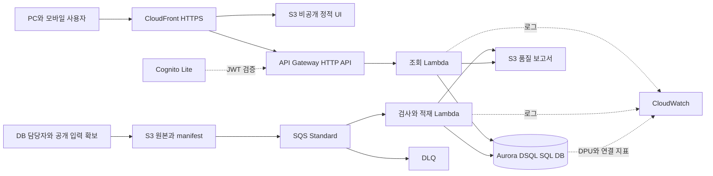
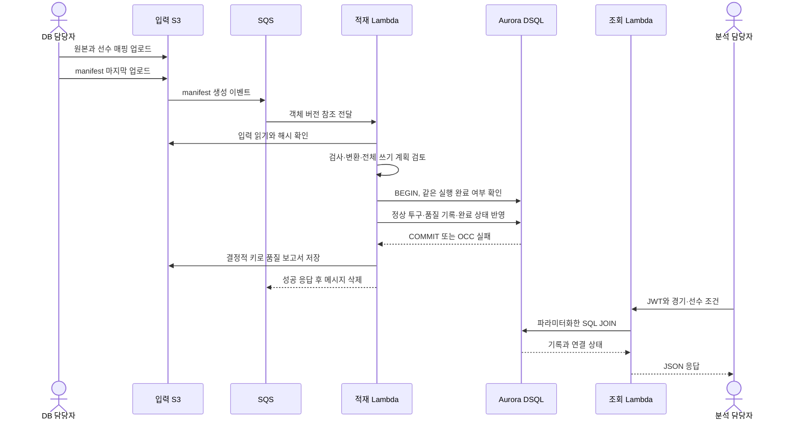
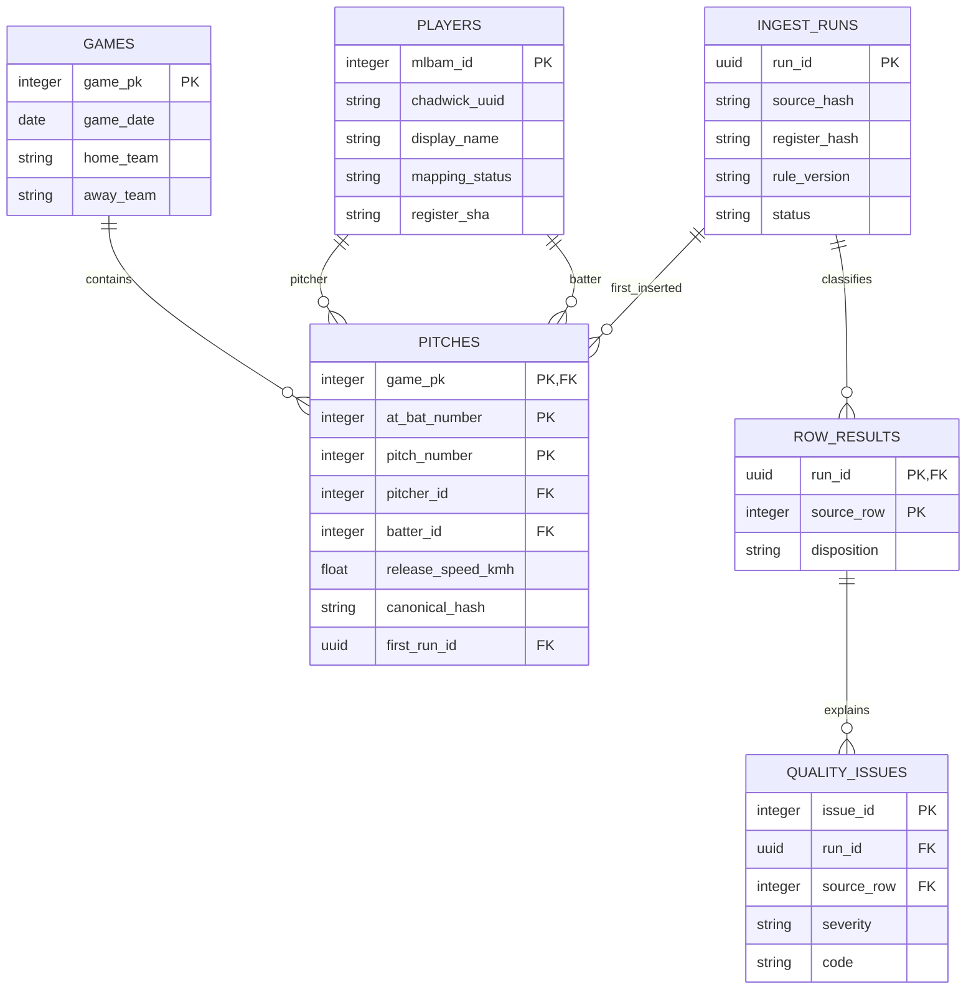

# AWS 서버리스 아키텍처와 Aurora DSQL

상태: 운영 설계. 작성일: 2026-10-06. 현재 실행 가능한 것은 가상 UI 목업과 비용 계산기이며 AWS 리소스·실제 DB·API는 배포 전입니다.

기본 가정은 서울 단일 리전입니다. 사용자가 SQL 필수와 Aurora DSQL을 선택했고, Lambda·API Gateway·S3·CloudFront·SQS를 운영 구성으로 제안합니다.

## 구성도




[Draw.io 원본](diagrams/architecture.drawio) · [Graphviz 원본](diagrams/architecture.dot)

## 컴포넌트와 책임

| 구성 | 역할 | 운영 정책 |
|---|---|---|
| CloudFront + UI S3 | PC·모바일 정적 화면, API 전달 | OAC, S3 공개 차단, API 캐시 비활성 |
| Cognito Lite | 직접 로그인 | JWT authorizer, DB 자격은 브라우저에 전달하지 않음 |
| HTTP API + 조회 Lambda | 조건 검증과 SQL 조회 | 읽기 SQL 역할, LIMIT 최대 100 |
| Aurora DSQL | 관계형 저장·JOIN·무결성 | IAM 인증, 단일 리전, 제한된 트랜잭션 |
| 원본 S3 | 변경 없는 자료와 manifest | versioning, SHA-256과 객체 버전 고정 |
| SQS + DLQ | 적재 완충·실패 보존 | 중복 전달 전제, 재시도와 격리 |
| 적재 Lambda | 검사·변환·선수 연결·SQL 적재 | 원본 해시 기반 중복 확인, OCC 재시도 |
| 보고서 S3 | 전체 행별 결과와 JSON 보고서 | DB를 기준으로 재생성 가능 |
| CloudWatch | 로그·에러·DSQL 소비량 관측 | 보존 30일, 표준 알람 5개 가정 |

기본 구성에 상시 서버·ALB·NAT Gateway·RDS Proxy는 없습니다. Lambda는 고객 VPC에 연결하지 않고 IAM으로 허용된 DSQL 공개 엔드포인트에 TLS 접속합니다. AWS 내부 시스템용 비공개 네트워크 요구가 생기면 PrivateLink 설계와 추가 비용을 별도로 반영합니다.

## 적재와 조회 흐름



S3와 DB는 서로 다른 트랜잭션입니다. DB 완료 후 보고서 저장이 실패하면 SQS 재전달에서 DB 완료 기록을 확인하고 보고서만 재생성합니다. 이미 완료된 전달의 중복은 새로운 투구 삽입으로 처리하지 않습니다. 확정적인 입력 오류는 실패 기록을 남기고 종료하며, 전송·DB 장애는 제한된 재시도 후 DLQ로 보냅니다.

## SQL 데이터 모델



실행 ID는 UUID입니다. 투구는 경기·타석·투구의 복합 PK, 행별 결과는 실행·입력 행의 복합 PK입니다. 품질 문제는 그 결과를 FK로 참조합니다. 선수 미연결 시 ID만 가진 행을 만들어 이름과 UUID는 NULL로 둡니다. 해당 리전의 DSQL은 외래 키를 지원하지만 실제 스키마는 마이그레이션 검증 대상입니다.

API 조회 예시 (설계용 SQL, 미실행):

```sql
SELECT p.game_pk, p.at_bat_number, p.pitch_number,
       p.pitcher_id, pitcher.display_name AS pitcher_name,
       p.batter_id, batter.display_name AS batter_name,
       p.release_speed_kmh, batter.mapping_status
FROM pitches AS p
LEFT JOIN players AS pitcher ON pitcher.mlbam_id = p.pitcher_id
LEFT JOIN players AS batter ON batter.mlbam_id = p.batter_id
WHERE p.game_pk = %s AND p.pitcher_id = %s
ORDER BY p.at_bat_number, p.pitch_number
LIMIT %s;
```

값은 드라이버의 파라미터 바인딩으로 전달합니다. 경기·투수·타자별 조회에 맞는 인덱스를 실제 데이터의 SQL 실행 계획으로 검토합니다. 페이지 이동은 offset 대신 마지막 타석·투구 키를 담은 cursor를 사용합니다. 필요하지 않은 전체 COUNT를 매 요청마다 실행하지 않습니다.

## API 계약안

| 조회 경로 | 결과 | 상태 |
|---|---|---|
| `GET /api/games` | 경기 목록 | 미등록이면 200과 빈 목록 |
| `GET /api/players?game_pk=…` | 경기별 선수 | 조건 오류 422, 경기 없음 404 |
| `GET /api/pitches?game_pk=…&pitcher_id=…&batter_id=…&limit=…&cursor=…` | 키 순 목록·다음 cursor | 조건 오류 422, 경기 없음 404, 결과 없음 200 |
| `GET /api/quality/runs` | 실행별 상태·건수 | 실행 전이면 빈 목록 |
| `GET /api/quality/runs/{run_id}` | 실행·행별 결과 | 실행 없음 404, 실패이면 상태·이유 |

모든 API는 인증된 읽기 전용입니다. 인증 없음·만료는 401, 권한 부족은 403, 과도한 요청은 429입니다. 원본 업로드는 승인된 운영 역할의 S3 접근으로 분리합니다. 상세 보고서의 S3 주소는 필요한 권한을 확인한 후 짧은 만료의 읽기 전용 presigned URL로 제공합니다.

## 경계와 완료 증거

작은 파일의 전체 쓰기 트랜잭션을 유지하되 변경 계획 2,000행·8MiB 이내로 제한합니다. 초과 입력은 쓰기 전에 중단합니다. SQLSTATE 40001은 전체 트랜잭션 단위로 재시도합니다. SQL JOIN·FK·재적재·충돌·재전달·DB 커밋 후 보고서 실패 테스트가 필요합니다. [ADR-006](adr/006-aurora-dsql.md)과 [운영 계획](operations.md)을 따릅니다.

[월 비용](cost-estimate.md)은 가정 기반입니다. 실제 DPU·저장량·실행 시간은 배포 후 측정해야 합니다.

## 확인한 공식 근거

[DSQL 리전](https://docs.aws.amazon.com/aurora-dsql/latest/userguide/), [트랜잭션·접속 한계](https://docs.aws.amazon.com/aurora-dsql/latest/userguide/CHAP_quotas.html), [FK 지원](https://docs.aws.amazon.com/aurora-dsql/latest/userguide/working-with-foreign-key-constraints.html), [IAM 커넥터](https://docs.aws.amazon.com/aurora-dsql/latest/userguide/SECTION_program-with-dsql-connector-for-python.html). 확인일: 2026-10-06.
